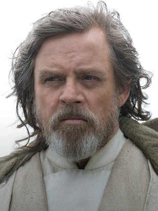

# <u>**Lebenslauf Luke Skywalker**</u>

- <u>Schullaufbahn:</u>

  - Grundschule -> 1960 -1968
  - Realschule mit Vertiefung in Feuchtfarmen -> 1968 - 1971

- <u>Berufliche Karriere</u>

  - Arbeiten im Familien Kleinbetrieb der Owens -> 1971 -1976
    - Aufgstiegen zum Stellvertretenen Geschäftsführer -> 1974
  - Nach neuen Möglichkeiten in der Branche gesucht (Arbeitslos) ->  1977
  - Rebellionen GmbH & Co KG -> 1977 - jetzt

- <u>Erfolge während der Karriere:</u>

  - Todesstern vernichtet (halbe Galaxie gerettet) -> 1977

  - Imperator besiegt und Vater gerettet -> 1983

  - Zur Legende aufgestiegen. -> 1983

    

